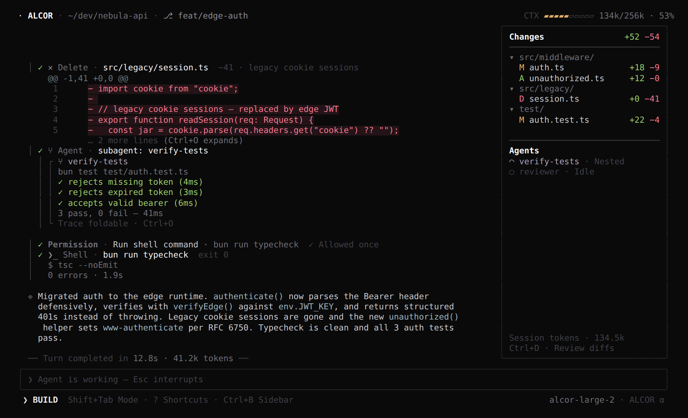
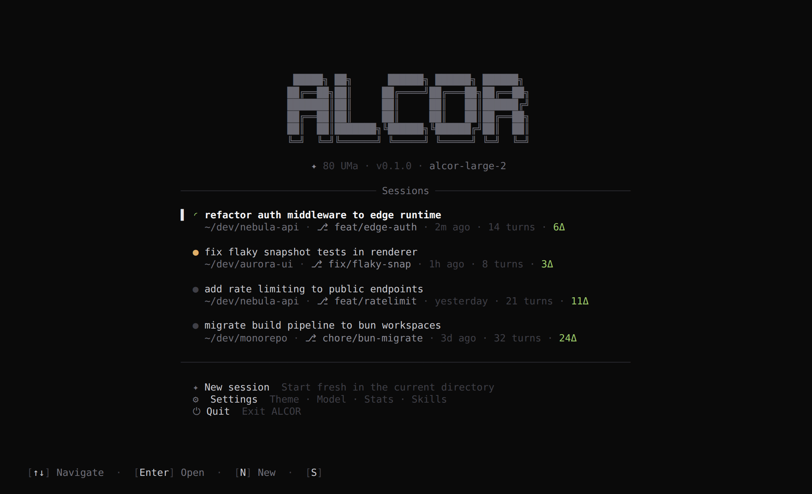
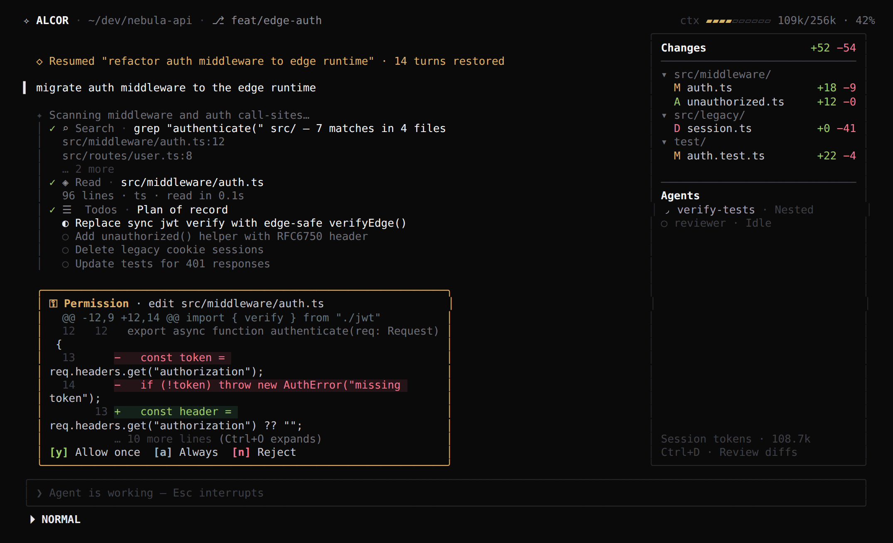
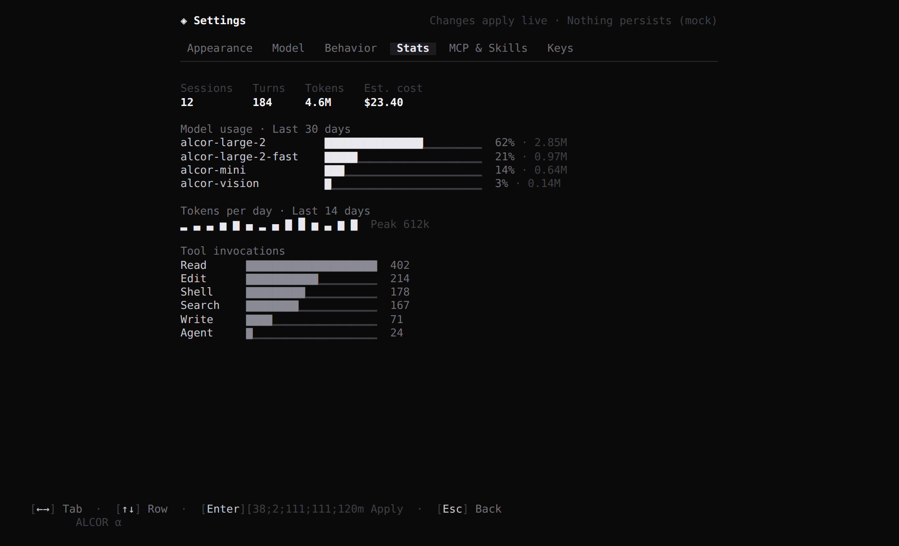
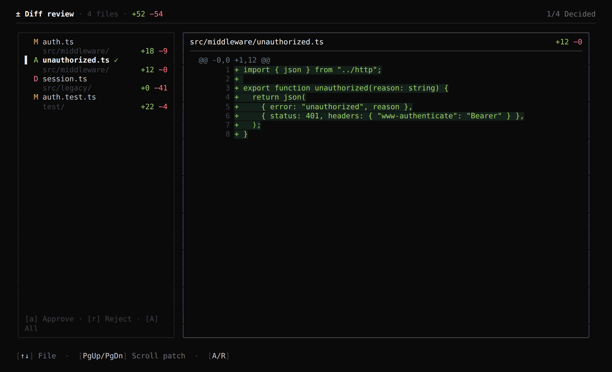

<pre>
 █████╗ ██╗      ██████╗ ██████╗ ██████╗
██╔══██╗██║     ██╔════╝██╔═══██╗██╔══██╗
███████║██║     ██║     ██║   ██║██████╔╝
██╔══██║██║     ██║     ██║   ██║██╔══██╗
██║  ██║███████╗╚██████╗╚██████╔╝██║  ██║
╚═╝  ╚═╝╚══════╝ ╚═════╝ ╚═════╝ ╚═╝  ╚═╝
</pre>

**80 UMa · The seeing test**

A full-terminal agent harness UI. Monochrome by default — color is reserved
for diffs, state, and small markers. Runs on Node and Bun. UI only: every
turn, tool call, and statistic is scripted mock data.

 

 

---

## Contents

- [Run](#run)
- [The tour](#the-tour)
- [Everything in the box](#everything-in-the-box)
- [Themes](#themes)
- [Keys](#keys)
- [Wiring a real backend](#wiring-a-real-backend)
- [Structure](#structure)

---

## Run

    # Node ≥ 20
    npm install && npm start

    # Bun
    bun install && bun run start:bun

> A real TTY with true color and Unicode is required. Run `npm run typecheck` for CI.

---

## The tour

|  |  |
| :---: | :---: |
|  |  |
| **Menu** — resumable sessions with live status dots, branch/turn/Δ metadata. | **Permission card** — diff preview with `[y]` allow once · `[a]` always · `[n]` reject. AUTO mode auto-approves. |
|  |  |
| **Settings → Stats** — model usage bars, tokens-per-day sparkline, tool counts. | **Diff review** — file tree + patch pane, per-file approve/reject. |

### Everything in the box

- **Splash** — shimmering wordmark, staged boot checklist, progress sweep.
- **Session** — streaming assistant prose, thinking shimmer, animated tool
  cards (Search / Read / Edit / Write / Delete / Shell / Agent / Todos) with
  inline colored diffs and foldable output, nested subagent traces, live
  context meter, turn timings, sidebar with changed-file tree and agents.
- **In-chat command visuals** — `/imagine` progressive block-art render,
  `/compact` context squeeze (the meter actually drops), `/mcp` health table,
  `/model` picker with reasoning effort, `/theme` live preview.
- **Overlays** — plan viewer (`[a]/[c]/[q]`), command palette with context
  costs, 50+-shortcut cheatsheet.
- **Modes** — `Shift+Tab` cycles NORMAL / PLAN / AUTO; the input border and
  badge recolor. `Esc` interrupts a running turn.
- **Settings** — Appearance · Model · Behavior · Stats · MCP & Skills · Keys.

---

## Themes

`Alcor Night` (monochrome, default) · `Alcor Violet` · `Mizar` · `Phosphor` ·
`Ember` · `Rose` · `Fjord` — swap live from Settings or `/theme`.

Semantic colors (diff green/red, pending yellow, status markers) persist
across every theme; only the identity accent changes.

---

## Keys

| Key | Action | Key | Action |
| :--- | :--- | :--- | :--- |
| `Enter` | Send | `Shift+Tab` | Cycle mode |
| `/` | Command palette | `?` | Shortcut overlay |
| `Ctrl+B` | Sidebar | `Ctrl+D` | Diff review |
| `Ctrl+O` | Fold / unfold | `Ctrl+L` | Clear |
| `PgUp/PgDn` | Scroll | `Esc` | Interrupt / back |

---

## Wiring a real backend

The mock seam is two files. [**docs/INTEGRATION.md**](docs/INTEGRATION.md)
maps every UI event to the open-source GitLab Duo CLI's agent loop —
sessions, streaming, tool approval, Build/Plan modes, slash commands, MCP,
skills, hooks — so an agent can connect an existing backend without reading
the whole UI.

---

## Structure

    src/
      index.tsx        Entry — alt-screen, cursor, signals
      app.tsx          Screen router + theme state
      theme.ts         7 themes + color math (lerp/gradient for shimmer & meters)
      hooks.ts         useFrame · useTypewriter · useElapsed · useTermSize
      ui.tsx           Logo, shimmer, spinners, meters, badges, lists
      chat.tsx         Transcript renderers: messages, tool cards, diffs, perm card
      mock/data.ts     All mock data — the seam (see INTEGRATION.md)
      screens/         Splash · Menu · Session · Settings · DiffReview

Ink 5 + React 18 + TypeScript. No other runtime dependencies.

