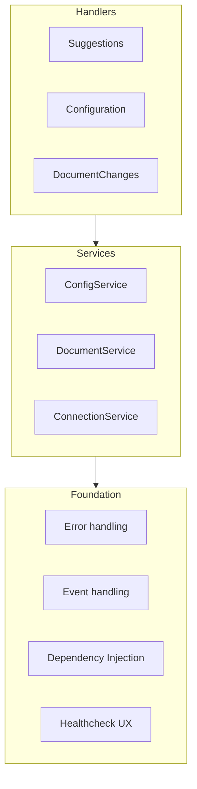
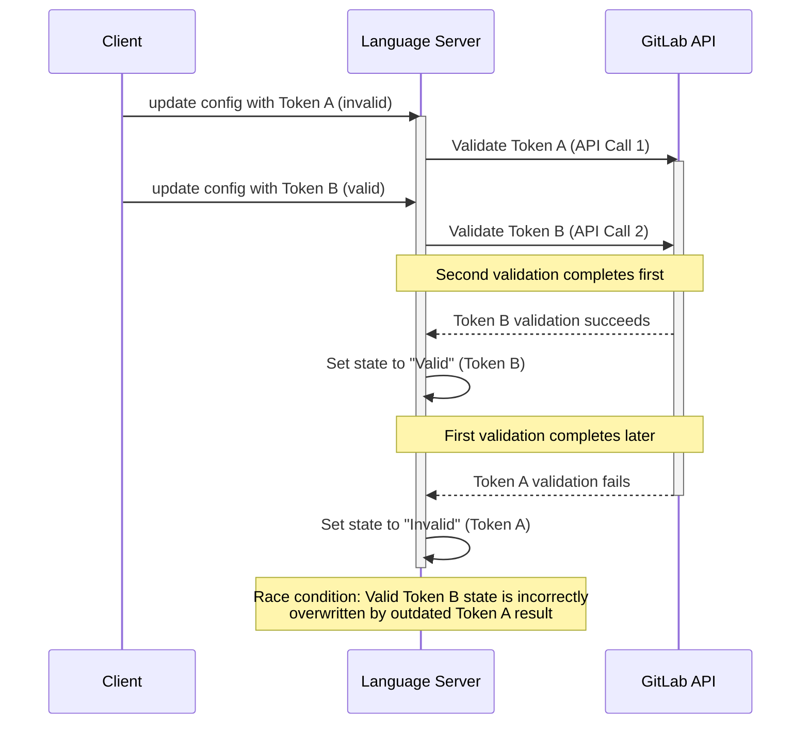
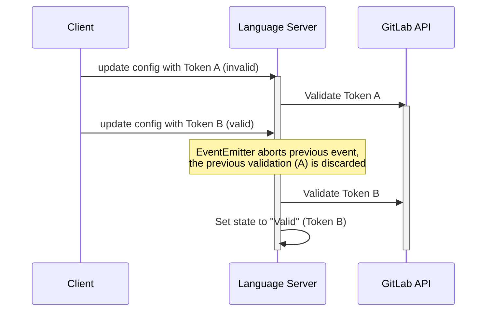

# GitLab Language Server Architecture

The GitLab Language Server (LS) is a TypeScript application powering predominantly GitLab Duo features in all GitLab extensions.

## Architecture overview

We have legacy 3 folders `src/common` `src/desktop` and `src/browser` that historically contained the whole LS, but now we try to group the code by its domain rather than type, ensuring that related functionality stays together. For example, all code suggestion code goes to the same location, rather than co-locating all services or controllers together.

The main package categories are:

- Platform Packages (`lib_disposable`, `lib_documentation`)
- RPC and Communication (`lib_rpc`, `lib_rpc_client`, `lib_rpc_endpoint`, `lib_message_bus`)
- WebView Support (`lib_webview*` packages)
- AI and Context Management (`lib_ai_context`)
- Development and Monitoring (`lib_logging`, `lib_telemetry`, `lib_schema`)

Each category serves a specific purpose in the overall system:

### Platform packages

- Provide foundational functionality and shared utilities
- Handle core language server protocol implementation
- Manage documentation and disposable resources
- Example: [`@giltab-org/core`](../../packages/lib_core) package (though we plan to further split this by domains into `config`, `api`, etc.)

### RPC and Communication

- Implement remote procedure calls and client-server communication
- Handle message validation and endpoint management
- Provide message bus for internal communication
- Example: [Message Bus](../../packages/lib_message_bus) library package

### WebView Support

- Enable UI components through WebView integration
- Handle WebView transport and themes
- Support chat and workflow interfaces
- Located in workspace `packages` directory inside a nested `src/app` directory.

### AI and Context Management

- Manage AI-related functionality and context
- Handle intent detection and parsing
- Provide contextual awareness for language features

### Development and Monitoring

- Support logging and telemetry
- Provide schema validation
- Enable monitoring and debugging capabilities
- Example: Utility packages like [logging](../../packages/lib_logging)

### Considerations

The [VS Code Extension](https://gitlab.com/gitlab-org/gitlab-vscode-extension) project has a very similar technology stack and will probably adopt parts of the GLS architecture over time.

### High-Level View



On the high-level, application will be built from these three layers:

### Foundation

The green components on the diagram are marked as _Foundation_. They don't directly represent modules in the system but capabilities of the system. We need to design interfaces and maybe choose frameworks for these capabilities.

- **Dependency Injection** (DI) - See the Dependency Injection section below for our approach to managing component dependencies and interactions.
- **Event handling** - See "Ongoing migrations" section for information about our RxJS-based event handling implementation.
- **Error handling** - See the Error Handling section below for our comprehensive approach to error management, logging, and tracking.

### Long-Living Services

The bluish components in the diagram are _Long-living services_. These are modules that are created at the start of the GLS and live for the whole duration of the main process.

A _Long-living service_ has a single responsibility, such as tracking document changes, and provides data/functionality to other services and request pipelines.

These services will be initialized through DI and can be further injected into other services and request code.

The services will use _Event handling_ to expose changes to any interested client code. For example, ContextBuilder can listen for config changes to understand if the current file's language is supported for code suggestions.

The services will use _Error handling_ to log errors and report some of them to Sentry.

### Handlers

Handlers are modules that listen on the Language Server connection and handle incoming/outgoing requests and notifications.

#### Request Pipeline

Complicated requests go through many procedural steps. We agree that this sequence of steps that turns a request into a response should be modelled as a pipeline with middlewares operating on a shared context.

The pipeline design will make for an extensible and encapsulated business logic for handling requests.

The **pipeline design is a work in progress**, and we have an [open spike to find and implement a concrete solution](https://gitlab.com/gitlab-org/editor-extensions/gitlab-lsp/-/issues/251).

Example steps for handling code suggestion requests:

1. enrich the request with the content of the active file
1. try to retrieve cached suggestion
1. debounce
1. detect intent
1. add advanced context
1. make a request for suggestions
1. cache the response
1. map API response to LS response type

## Development Guidelines

This section lays out patterns that we as a team agree are generally the way to build within the project. Divergence
will happen and we accept that, however everyone should know these as baseline to know what we generally expect.

### Ongoing migrations

- LS Webviews - We want to host all webviews in the LS. Please look at [Integrate GitLab Duo Chat WebView from Language Server](https://gitlab.com/groups/gitlab-org/-/epics/15661) epic as the SSOT for the remaining work for migrating GitLab Duo Chat to LS
- RxJS to handle events - We've [decided to use RxJS for event handling](https://gitlab.com/gitlab-org/editor-extensions/gitlab-lsp/-/issues/244). See [\[LS\]: Migrate Language Server configuration handlers to RxJS](https://gitlab.com/groups/gitlab-org/editor-extensions/-/epics/92) for more information on this migration

### Type Definitions

Define types as strictly as possible. Leverage union types to create more precise type constraints, ensuring clearer and more predictable code structures. A good approach is to explicitly define different type shapes, such as `{type: x, text: y} | {type: a, val: b}`, which provides more clarity than using optional properties or mixed type definitions.

### Package Location

Our long-term architectural vision involves progressively migrating code into dedicated packages. When introducing new code, carefully evaluate the most appropriate location between the `src` and `packages` directories, considering the specific responsibilities and potential reusability of the module knowing that we want `src` to eventually contain the strict minimum.

### Testing Strategy

- Implement happy-path scenarios in VS Code Extension E2E tests
- Prioritize integration tests for the Language Server
- Integration tests for LS and E2E tests for VS Code Extension give us the highest level of confidence
- Include Windows-specific E2E tests for filesystem functionality to ensure cross-platform compatibility

### Dependency Injection (DI)

Use DI as the primary strategy for managing component interactions.

DI was introduced to help us avoid passing all the dependencies through several layers of a call stack.

### Module Organization

Craft your code with well-defined top-level exports that clearly expose the public API. Maintain distinct boundaries between modules to promote modularity and ease of understanding. Exercise particular caution when working with the browser directory, especially in the WebIDE context. Be mindful to prevent node-specific dependencies like filesystem, OS, or shell utilities from infiltrating common or browser-specific directories.

### Event handling

Implement an event system to share the service state with notifications. In other words, low-level services like the `ApiClient` or `ConfigService` should fire events when their state changes rather than updating the "listeners" listeners directly.

[Spike: Decide which dependency injection to use for TS systems](https://gitlab.com/gitlab-org/editor-extensions/meta/-/issues/114) is a spike that will decide on which DI implementation we'll use.

### Error Management Approach

We use a structured approach to error handling that combines traditional exception handling with functional error management:

#### Result-Based Error Handling with `neverthrow`

- **Prefer returned errors over exceptions**: Use the `neverthrow` library's `Result<T, E>` type for operations that can fail predictably
- **Implementation introduced in**: [MR #2049](https://gitlab.com/gitlab-org/editor-extensions/gitlab-lsp/-/merge_requests/2049#note_2657244822) for configuration loading and validation
- **Motivation**: Provides type-safe, explicit error handling that makes failure modes visible at the type level
- **Usage pattern**: Functions return `Result<Success, Error>` instead of throwing exceptions, enabling callers to handle both success and error cases explicitly

```typescript
// Preferred: Using Result types
function loadConfig(): Result<Config, ConfigError> {
  // Implementation returns ok(config) or err(error)
}

// Usage
const configResult = loadConfig();
if (configResult.isErr()) {
  handleConfigError(configResult.error);
  return;
}
const config = configResult.value;
```

#### Legacy Exception Handling

For legacy code and external library integration only:

- Use try/catch blocks for unexpected scenarios
- Follow the [Error tracking guide](https://gitlab.com/gitlab-org/editor-extensions/gitlab-lsp/-/blob/main/docs/developer/error_tracking.md) when reporting to Sentry

### Performance Monitoring (future desired state)

- Track key metrics during errors: open workspaces, files in use, operation latency

### Resiliency

This section describes how the system handles errors/failures from outside of the system boundary.

- Network errors - Network can be down or the server responds with non-2xx response code
- Client "rough behavior" - for example when the client triggers the same request many times in quick succession

#### `retry` recoverable errors

For failures where you believe they could work if you try again, use the `@gitlab-org/resiliency` [`retry` function](https://gitlab.com/gitlab-org/editor-extensions/gitlab-lsp/-/blob/2e89a5f9e3f6a62e92c38e726aaff901cba8fc31/packages/lib_resiliency/src/retry.ts#L70):

```typescript
try {
  this.value = retry(api.fetchOperation(request), {signal});
} catch(e) {
  if(isAbortError(e)) return;
  log.error('failed', e);
}
```

For an example of how we use retry in the codebase see our [ApiStateCheck](https://gitlab.com/gitlab-org/editor-extensions/gitlab-lsp/-/blob/2e89a5f9e3f6a62e92c38e726aaff901cba8fc31/src/common/feature_state/api_state_check.ts#L58).

#### Use `AbortSignal` to avoid race conditions

If you are updating persistent state like API Configuration, Repository state, Network Configuration. Avoid race conditions by using `AbortSignal`.

Race conditions happen when the LS reacts to the client input (request or notification).

##### Handle race conditions in events

See [an example of a race condition](#race-condition-example) that we solved.

We attach `AbortSignal` to every event. This `signal` gets aborted as soon as the new event is emitted. Use it like this:

```typescript
api.onApiReconfigured((data, signal) => {
    // do an action first
    const intermediateState = myAction();
    // only mutate the state if the action has not been aborted
    if(signal.aborted) return;
    this.#mutableState = intermediateState;
}
```

Keep in mind that the `retry` operation mentioned above supports the use of `AbortSignal`:

```typescript
api.onApiReconfigured((data, signal) => {
  try {
    this.value = retry(api.fetchOperation(request), {signal});
  } catch(e) {
    // retry throws AbortError when the signal is aborted
    if(isAbortError(e)) return;
    log.error('failed', e);
  }
}
```

##### Handle race conditions in requests

The LSP and the `vscode-languageserver` library provide [cancellation mechanism](https://microsoft.github.io/language-server-protocol/specifications/lsp/3.17/specification/#cancelRequest). You receive a `CancellationToken` with every request. Respect this token and cancel the execution if the token gets canceled.

As an example, we use the cancellation token when we [provide code suggestions](https://gitlab.com/gitlab-org/editor-extensions/gitlab-lsp/-/blob/2e89a5f9e3f6a62e92c38e726aaff901cba8fc31/src/common/suggestion/suggestion_service.ts#L266).

We haven't done it yet, but it would be worth converting the `CancellationToken` to `AbortSignal` and using only `AbortSignal` throughout the whole codebase.

##### Race condition example

For example, race condition previously happened when the client updated configuration in close succession:



And we avoid it by aborting the first validation using the `AbortSignal` provided by the `EventEmitter`.



There is [an existing issue](https://gitlab.com/gitlab-org/gitlab-vscode-extension/-/issues/1264) that we can re-purpose to track this discussion if the above guidelines aren't sufficient.

### Tracking

We are using Sentry for error tracking. Check out [this epic](https://gitlab.com/groups/gitlab-org/editor-extensions/-/epics/51) for current state of Sentry integration. Sentry is a GitLab-wide tool for error tracking, the only one that's approved.

### Logging

Our logging should be oriented towards capturing the system's state at the time of the error rather than an arbitrary sequence of debug logs. When a panic happens (see [Resiliency](#resiliency) for panic definition), we should capture the system's (_Long-living components_) and pipeline's (_per request components_, request and context) state. The error handler will have to have access to the DI container to compile the state information.

[This issue](https://gitlab.com/gitlab-org/editor-extensions/gitlab-lsp/-/issues/248) captures a follow-up discussion on structured and scoped logging.

### Diagnostics

The system components should provide diagnostics information upon request. When an error occurs or when the user manually invokes diagnostics, we will ask each component to give us information about its state/health, aggregate the response and put it in the logs.

Rough example of the aggregated diagnostics response:

```txt
Account service:
- active account: viktomas (gitlab.com) (OAuth)
- configured accounts: viktomas (gitlab.com) (OAuth), fred-tester (self-managed) (PAT)

----
Git service:
- git repositories
  - /full/path/to/the/folder
    - remotes:
      - origin: git@gitlab.com/group/project
      - fork: git@gitlab.com/user/project
---
Duo:
- enabled for project: false
- user has valid license: true
```
