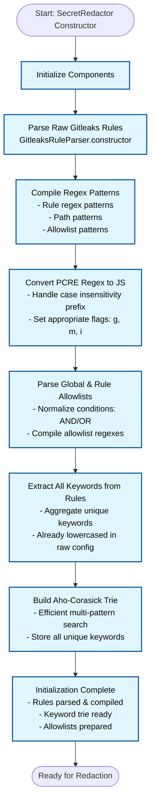
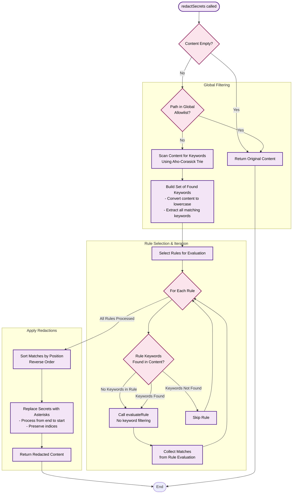
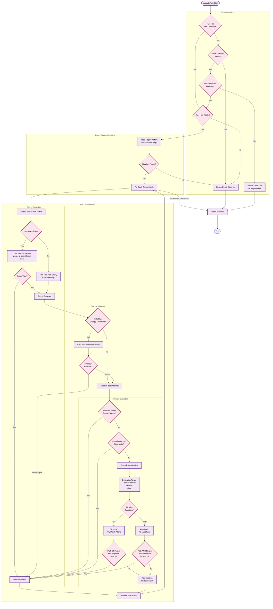

# Secret Redaction

The `lib_secret_redaction` package provides secret detection and redaction capabilities using rules derived from the [Gitleaks project](https://github.com/gitleaks/gitleaks).

## Updating Gitleaks Rules

Our Gitleaks rules are adapted from the upstream Gitleaks project. To update them:

1. Grab a copy of the latest Gitleaks rules from the repo
1. Convert TOML to JSON, replace the `rawConfig` object in `packages/lib_secret_redaction/src/gitleaks_rules.ts`
1. Run `bun run autofix` to format the JSON as TypeScript

### Quick Update Script

Here is a Python 3.11+ one-liner that fetches and converts the latest rules:

```python
python3 -c "import tomllib, json, urllib.request; response = urllib.request.urlopen('https://raw.githubusercontent.com/gitleaks/gitleaks/refs/heads/master/config/gitleaks.toml'); print(json.dumps(tomllib.loads(response.read().decode('utf-8')),indent=2))"
```

## Secret Redaction Process

The language server goes through two stages when using these rules - initialisation and evaluation.

### Initialisation - Rule Parsing and Optimization

The raw Gitleaks rules are stored as JSON with regex patterns as strings. At runtime, the `GitleaksRuleParser` service pre-processes these rules for better performance:

1. **Regex precompilation**: All regex patterns (rule matchers, allowlists, path filters) are compiled from strings to `RegExp` objects once at startup
1. **Regex syntax conversion**: Gitleaks uses Go regex syntax, which is converted to JavaScript-compatible patterns (e.g., handling `(?i)` case-insensitivity flags)
1. **Keyword trie construction**: All rule keywords are aggregated into an [Aho-Corasick](https://en.wikipedia.org/wiki/Aho%E2%80%93Corasick_algorithm) trie for efficient multi-pattern matching
1. **Condition normalization**: Allowlist conditions (`AND`, `&&`, `or`, etc.) are normalized to a consistent format

This parsing happens once when the service is instantiated, so rule evaluation at detection time only uses the precompiled structures.

<details>
<summary>Click to expand</summary>



</details>

### Rule evaluation

This is the "hot path" where some content needs to be checked/redacted, for example when we are generating code suggestions as the user is typing.

#### Pre-filtering

Global allowlist checking, keyword matching to skip redactions and creates a smaller specific set of rules to check

<details>
<summary>Click to expand</summary>



</details>

#### Per-rule evaluation

Runs each rule, applying different checks/flows depending on the rule type

<details>
<summary>Click to expand (big...)</summary>



</details>

#### Redaction

If any rules matched and identified sensitive ranges in the content, we redact it.
