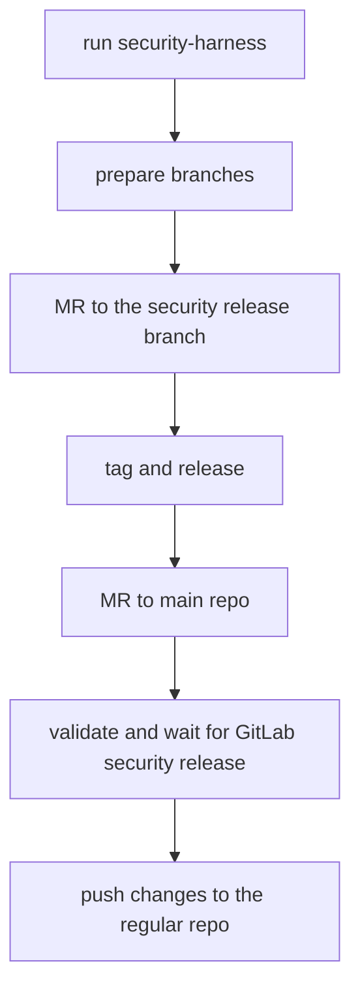

# Security Releases

This guide is based on the main [`gitlab-org/gitlab` security release process](https://gitlab.com/gitlab-org/release/docs/-/tree/master/general/security)

## DO NOT PUSH TO `gitlab-org/editor-extensions/gitlab-lsp`

As a developer working on a fix for a security vulnerability, your main concern is not disclosing the vulnerability or the fix before we're ready to publicly disclose it.

To that end, you'll need to be sure that security vulnerabilities are fixed in the [Security Repo](https://gitlab.com/gitlab-org/security/editor-extensions/gitlab-lsp).

This is fundamental to our security release process because the [Security Repo](https://gitlab.com/gitlab-org/security/editor-extensions/gitlab-lsp) is not publicly-accessible.

## Process

A security fix starts with an issue identifying the vulnerability. In this case, it should be a confidential issue on the `gitlab-org/editor-extensions/gitlab-lsp` project on [GitLab.com](https://gitlab.com/)

Once a security issue is assigned to a developer, we follow the same merge request and code review process as any other change, but on the [Security Repo](https://gitlab.com/gitlab-org/security/editor-extensions/gitlab-lsp).

### Schema



### Preparation

To contribute a security fix, clone the security repository separately:

```shell
git clone git@gitlab.com:gitlab-org/security/editor-extensions/gitlab-lsp.git security-gitlab-lsp
```

### Request CVE number

For exploitable security issues, request a CVE number by [creating an issue in `gitlab-org/cves` project](https://gitlab.com/gitlab-org/cves/-/issues/new). **You can do the release before the CVE number is available.** When the CVE number is assigned, add it to the [changelog entry](https://gitlab.com/gitlab-org/editor-extensions/gitlab-lsp/-/blob/main/CHANGELOG.md).

Example CVE request: [https://gitlab.com/gitlab-org/cves/-/issues/21](https://gitlab.com/gitlab-org/cves/-/issues/21)

### Branches

The main objective is to release the security fix as a patch of the latest production release and backporting this fix on `main`.

Your fix is going to be pushed into `security-<issue number>` branch. If you work on issue #9999, you push the fix into `security-9999` branch.

### Development

Here, the process diverges from the [`gitlab-org/gitlab` security release process](https://gitlab.com/gitlab-org/release/docs/-/tree/master/general/security).

1. Implement the fix and push it to your branch (`security-9999` for issue #9999).
1. Create an MR to merge `security-9999` to the main branch of the [Security Repo](https://gitlab.com/gitlab-org/security/editor-extensions/gitlab-lsp) and get it reviewed.
1. Before merging, read the Release and Backport sections below and ensure that you are prepared for all steps (for instance that a maintainer is available).
   - A long period of time between merge and release/backport could cause issues such as the mirror sync failing or the changelog getting out of order.
   - Ensure that the repo has synced successfully since the latest changes on the canonical repo.
   - Consider declaring a code freeze in the canonical repo until the backport is finished. This will ensure that a manual mirror sync will not be required later.
1. Merge the fix (make sure you squash all the MR commits into one).

### Release the change

The release can be made from the [Security Repo](https://gitlab.com/gitlab-org/security/editor-extensions/gitlab-lsp) main branch, following the regular process.

1. Declare in the `#f_language_server` channel on Slack that you're about to do a release and that there's a release freeze on the canonical project.
   - This is to prevent another person from publishing a release in the canonical repo. This situation must be avoided as it could lead to two different releases with the same version number.
1. Follow the regular release process. See [release process docs](./release-process.md) for instructions.
1. Perform a backport. See the [Backport the fix to the canonical repository](#backport-the-fix-to-the-canonical-repository) section below.
1. Notify `#f_language_server` that canonical releases may now resume.

**Note:** Releases of the GitLab LSP will publish packages to the following public locations:

- [https://www.npmjs.com/package/@gitlab/duo-cli](https://www.npmjs.com/package/@gitlab/duo-cli)
- [https://gitlab.com/gitlab-org/editor-extensions/gitlab-lsp/-/packages/](https://gitlab.com/gitlab-org/editor-extensions/gitlab-lsp/-/packages/)
  - Includes NPM and NuGet packages, as well as Generic (binary) packages.

It is not possible to publish to a private package registry at this time, follow [this issue](https://gitlab.com/gitlab-org/editor-extensions/meta/-/work_items/293) for more details.

If you are including the fix in a downstream project, ensure that the fix is ready to merge before releasing the GitLab LSP.

### Backport the fix to the canonical repository

To backport the fix to the [canonical language server repository](https://gitlab.com/gitlab-org/editor-extensions/gitlab-lsp):

1. Create an MR from the security project:
   - **Source project:** `gitlab-org/security/editor-extensions/gitlab-lsp`
   - **Source branch:** `main`
   - **Target project:** `gitlab-org/editor-extensions/gitlab-lsp`
   - **Target branch:** `main`
1. Releases using `semantic-release` will create a new commit and tag for the release.
   - Include the release commit in the backport MR and ensure that squashing is set to **OFF**.
   - The tag must be manually dealt with after merge (see step 5 below).
1. If there are conflicts, fix those and get a maintainer to review them. Otherwise no review is necessary since the changes have already been reviewed.
1. Merge the MR.
1. Releases using `semantic-release` will create a new tag. Someone with the Maintainer Role must now create and push a matching tag to the canonical repo. For instance:

```shell
# In the canonical repo (not the security fork)
git fetch origin main
git tag v<new-version> <release-commit-sha>
git push origin v<new-version>
```

1. Once the backport is merged, the automated push to the mirror should resume. If it does not, see the [manual sync](#manual-push-mirror-sync) section below.

### Manual Push Mirror Sync

If the mirror does not sync correctly after backporting, this is likely because the commit order has changed. You will see the following error in the [mirror settings](https://gitlab.com/gitlab-org/editor-extensions/gitlab-lsp/-/settings/repository#js-push-remote-settings):

> "Some refs have diverged and have not been updated on the remote: refs/heads/main"

In this case you may need to perform a manual sync.

To do this, we'll enable the **Keep divergent refs** setting for the mirror relationship. **Important note:** this will overwrite any protected branches (including `main`) on the mirror project.

**Prerequisites:** You have the Maintainer Role or higher.

1. Ensure there are no un-backported changes on the security mirror. You can do this by comparing changes from the security mirror `main` branch to the canonical repo `main` branch.
   - Navigate to the [Compare page](https://gitlab.com/gitlab-org/security/editor-extensions/gitlab-lsp/-/compare?from=main&to=main).
   - Select **GitLab.org / editor-extensions / GitLab Language Server**.
   - Select **Show changes: Only incoming changes from source**.
   - Select **Compare**.
1. (Optional) If there are other MRs in progress on the security mirror, consider announcing a code freeze on the security mirror in the `#f_language_server` channel on Slack to ensure that no new changes are introduced during the sync process.
1. Update the **Keep divergent refs** setting via the API according to [these instructions](https://docs.gitlab.com/api/remote_mirrors/#update-a-remote-mirrors-attributes).

   ```shell
   curl --request PUT \
   --header "PRIVATE-TOKEN: %TOKEN%" \
   --header "Content-Type: application/json" \
   --data '{ "keep_divergent_refs": false }' \
   "https://gitlab.com/api/v4/projects/46519181/remote_mirrors/2962314"
   ```

1. In the mirror settings page, select "Update Now" to sync the push mirror.
1. A background job is triggered. Wait for the mirror push to succeed.
1. Reset the **Keep divergent refs** setting back to `true`.

   ```shell
   curl --request PUT \
   --header "PRIVATE-TOKEN: %TOKEN%" \
   --header "Content-Type: application/json" \
   --data '{ "keep_divergent_refs": true }' \
   "https://gitlab.com/api/v4/projects/46519181/remote_mirrors/2962314"
   ```

1. (Optional) Announce that the code freeze is complete.
